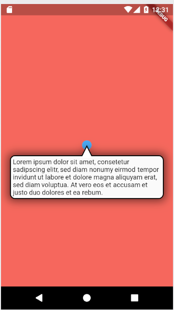

# super_tooltip


```Dart
// We create the tooltip on the first use
tooltip = SuperTooltip(
  popupDirection: TooltipDirection.down,
  content: new Material(
      child: Text(
        "Lorem ipsum dolor sit amet, consetetur sadipscingelitr, "
        "sed diam nonumy eirmod tempor invidunt ut laboreet dolore magna aliquyam erat, "
        "sed diam voluptua. At vero eos et accusam et justoduo dolores et ea rebum. ",
    softWrap: true,
  )),
);
```

Image default 

